# Spider-Man Villain Timeline - Data Flow Diagram

## Complete Pipeline Flow (End-to-End)

```mermaid
graph TD
    A["npm run scrape<br/>npm run process<br/>npm run merge<br/>npm run publish<br/>npm run serve"] --> START["Complete Workflow"]

    START --> SCRAPE["🔷 SCRAPE PHASE<br/>data/raw.*.json"]
    SCRAPE --> S1["ScrapeRunner"]
    S1 --> S2["MarvelScraper"]
    S2 --> S3["Extract issue data<br/>from Marvel Fandom"]
    S3 --> S4["data/raw.Amazing_Spider-Man_Vol_1.json<br/>data/raw.Annual_Vol_1.json<br/>data/raw.Untold_Tales_Vol_1.json"]

    S4 --> PROCESS["🔶 PROCESS PHASE<br/>villains.*.json<br/>d3-config.*.json"]
    PROCESS --> P1["ProcessRunner"]
    P1 --> P2["DataProcessor"]
    P2 --> P3["Normalize & classify<br/>Extract groups<br/>Generate timeline"]
    P3 --> P4["SerializeProcessedData<br/>Create D3Config"]
    P4 --> P5["data/villains.Amazing_Spider-Man_Vol_1.json<br/>data/d3-config.Amazing_Spider-Man_Vol_1.json<br/>... per series"]

    P5 --> MERGE["🔷 MERGE PHASE<br/>villains.json<br/>d3-config.json"]
    MERGE --> M1["MergeRunner"]
    M1 --> M2["MergeDatasets"]
    M2 --> M3["Identity merge<br/>Combine timelines"]
    M3 --> M4["D3ConfigBuilder.buildAndSaveFromCombined"]
    M4 --> M5["data/villains.json<br/>data/d3-config.json"]

    M5 --> PUB["📤 PUBLISH PHASE"]
    PUB --> PB1["Publisher"]
    PB1 --> PB2["ValidateSources"]
    PB2 --> PB3["Copy .json files<br/>Report sizes"]
    PB3 --> PB4["public/data/villains.json<br/>public/data/d3-config.json<br/>... all data files"]

    PB4 --> SERVE["🌐 SERVE PHASE"]
    SERVE --> SV1["StaticServer<br/>Node.js HTTP"]
    SV1 --> SV2["Listen on port 8000<br/>Serve public/"]
    SV2 --> SV3["http://localhost:8000"]

    SV3 --> UI["🕷️ VISUALIZATION<br/>D3.js Timeline"]
    UI --> END["User interacts with<br/>villain timeline"]
```

## Detailed Serving & Publishing Flow

```mermaid
graph TD
    PUBLISH["npm run publish"] --> PUB1["Publisher.run<br/>options: src, dest"]

    PUB1 --> VALIDATE["validateSources<br/>Check directory<br/>Check pattern"]
    VALIDATE --> V1{"Source<br/>exists?"}
    V1 -->|No| ERR1["❌ Validation failed<br/>Source directory not found"]
    V1 -->|Yes| V2{"Files<br/>match?"}
    V2 -->|No| ERR2["❌ Validation failed<br/>No files found"]
    V2 -->|Yes| COPY["Copy all .json files"]

    COPY --> TRACK["Track file sizes<br/>KB per file"]
    TRACK --> REPORT["Report results<br/>File count<br/>Total size MB"]
    REPORT --> PUB_SUCCESS["✅ Published<br/>to public/data/"]

    PUB_SUCCESS --> SERVE["npm run serve"]
    SERVE --> SS["StaticServer<br/>options: port, directory"]

    SS --> START_SV["Start HTTP server<br/>Listen on port 8000"]
    START_SV --> REQ["Client requests<br/>http://localhost:8000/"]

    REQ --> ROUTE["Route request"]
    ROUTE --> SECURITY["Check directory<br/>traversal"]
    SECURITY --> MIME["Detect MIME type"]
    MIME --> SERVE_FILE["Serve file<br/>HTML/JS/CSS/JSON"]
    SERVE_FILE --> BROWSER["Browser renders<br/>visualization"]

    BROWSER --> UI["User interacts<br/>D3.js timeline"]

    BROWSER --> SHUTDOWN["Ctrl+C pressed"]
    SHUTDOWN --> GRACEFUL["Graceful shutdown<br/>SIGINT handler"]
    GRACEFUL --> STOP["Close HTTP server"]
    STOP --> CLEANUP["Release port 8000"]
```

## Scraping Process Flow

## Data Merge Logic

## Architecture: StaticServer + Publisher

## Key Files in Data Flow

| File                           | Purpose                    | Created By               |
| ------------------------------ | -------------------------- | ------------------------ |
| `src/index.ts`                 | Main CLI orchestrator      | Core logic               |
| `src/scraper/marvelScraper.ts` | Individual series scraper  | Series-specific scraping |
| `src/utils/ScrapeRunner.ts`    | Scrape orchestration       | Workflow runner          |
| `src/utils/ProcessRunner.ts`   | Process orchestration      | Workflow runner          |
| `src/utils/MergeRunner.ts`     | Merge orchestration        | Workflow runner          |
| `src/utils/Publisher.ts`       | Publishing with validation | Workflow runner          |
| `src/utils/StaticServer.ts`    | HTTP server (Node.js)      | Workflow runner          |
| `data/raw.*.json`              | Raw scraped data           | ScrapeRunner             |
| `data/villains.*.json`         | Per-series processed data  | ProcessRunner            |
| `data/d3-config.*.json`        | Per-series D3 config       | ProcessRunner            |
| `data/villains.json`           | **Combined all series**    | MergeRunner              |
| `data/d3-config.json`          | **Combined D3 config**     | MergeRunner              |
| `public/data/*`                | Published data files       | Publisher                |
| **Browser**                    | Visualization              | StaticServer + script.js |

## Module Dependencies

