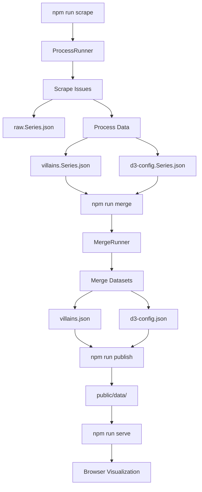
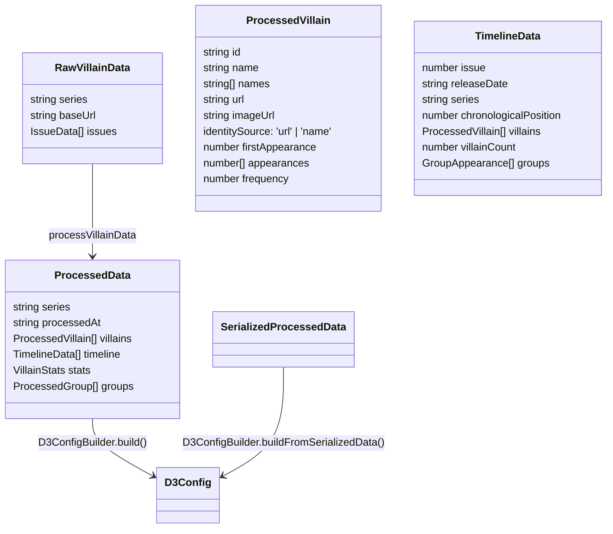

# Functional Documentation: Spider-Man Villain Timeline

This document describes the functional behavior of the system: how scraping, processing, merging, and visualization work together. It also highlights refactoring and redesign opportunities based on current implementation.

## System Overview

- **Goal:** Scrape Marvel Fandom issues for Spider‑Man series, normalize antagonist data, compute timeline statistics, and render interactive D3 visualizations.
- **Core Stages:** Scrape → Process → Serialize → Merge → Generate D3 Config → Publish → Visualize.
- **Primary Modules:**
  - [src/index.ts](src/index.ts) — CLI entry point and command router.
  - [src/utils/ProcessRunner.ts](src/utils/ProcessRunner.ts) — Orchestrates scrape → process → serialize workflow for single series.
  - [src/utils/MergeRunner.ts](src/utils/MergeRunner.ts) — Orchestrates merging of series-specific files into combined outputs.
  - [src/scraper/marvelScraper.ts](src/scraper/marvelScraper.ts) — HTTP requests and HTML parsing (Axios + Cheerio).
  - [src/utils/dataProcessor.ts](src/utils/dataProcessor.ts) — Normalization, deduplication, stats, timeline.
  - [src/utils/mergeDatasets.ts](src/utils/mergeDatasets.ts) — Combine series datasets into a unified timeline.
  - [src/visualization/D3ConfigBuilder.ts](src/visualization/D3ConfigBuilder.ts) — Unified D3 config builder (consolidates d3Graph.ts and generateD3FromCombined.ts).
  - [src/visualization/d3Graph.ts](src/visualization/d3Graph.ts) — Legacy compatibility layer (delegates to D3ConfigBuilder).
  - [src/utils/cliParser.ts](src/utils/cliParser.ts) — CLI option parsing for volumes and issues.
  - [src/types.ts](src/types.ts) — Shared typed model.

## Functional Flow



## Module Responsibilities

- **CLI Orchestration:**
  - Reads args and decides single vs multi‑series runs. See [src/index.ts](src/index.ts).
  - EnsuEntry Point:\*\*
  - Routes commands (`scrape`, `merge`, `publish`) to appropriate runners. See [src/index.ts](src/index.ts).
  - Ensures data directories exist.

- **ProcessRunner:**
  - Orchestrates single-series scraping and processing workflow. See [src/utils/ProcessRunner.ts](src/utils/ProcessRunner.ts).
  - Writes three files per series: `raw.Series.json`, `villains.Series.json`, `d3-config.Series.json`.
  - Supports scraping all configured series or a single series with issue range.

- **MergeRunner:**
  - Merges series-specific `villains.*.json` files into combined outputs. See [src/utils/MergeRunner.ts](src/utils/MergeRunner.ts).
  - Applies chronological placement hints for proper issue ordering.
  - Writes two files: `villains.json` and `d3-config.json`.

- **Scraper:**
  - Fetches issue pages and extracts antagonists lists and metadata (title, dates). See [src/scraper/marvelScraper.ts](src/scraper/marvelScraper.ts).
  - Expected behavior: rate‑limit to ~1 req/sec, cache, and validate data before emission.
  - Saves raw scraped data to `raw.Series.json` for reproducibility.
  - **Series Name Handling:** Extracts full series name from URL template (e.g., `Amazing_Spider-Man_Vol_1` from URL) and converts to display format (e.g., `Amazing Spider-Man Vol 1`) for proper placement hint matching during merge.
  - **Antagonist Filtering:** Uses `isUnnamedOrInvalidAntagonist()` helper to exclude:
    - "unknown", "unnamed", "unidentified" (case-insensitive, exact or prefix matches)
    - Single character placeholders like "?"
    - Whitespace-only names
    - This filtering prevents invalid entities from entering the dataset

- **Processor:**
  - Normalizes names, removes aliases, and standardizes spacing via `normalizeVillainName()`.
  - Uses canonical URL as identity when available via `getCanonicalUrl()`; falls back to normalized name.
  - Aggregates appearances, computes `firstAppearance`, `frequency`, and `names` variants.
  - Separates groups using `classifyKind()`; builds per‑issue `groups` with dynamic `members` from villains present.
  - Generates `timeline` with `chronologicalPosition` and per‑issue `villainCount`.
  - Computes `stats`: `totalVillains`, `mostFrequent`, `averageFrequency`, `firstAppearances` map.
  - **Data Quality Layer:** Also applies `isUnnamedOrInvalidAntagonist()` filtering during data processing as additional validation layer
  - Serializes into UI‑ready JSON via `serializeProcessedData()`. See [src/utils/dataProcessor.ts](src/utils/dataProcessor.ts).

- **Merger:** (saved to `raw.Series.json`).
- `ProcessedData` → normalized output (villains, timeline, groups, stats).
- `SerializedProcessedData` → JSON-serializable format with `identitySource` field.
- `D3Config` → visualization config consumed by [public/script.js](public/script.js).
- **Series outputs:**
  - `raw.Series.json` - Original scraped HTML data
  - `villains.Series.json` - Processed villain data
  - `d3-config.Series.json` - D3 visualization config
- **Combined outputs:**
  - `villains.json` - Merged data from all series
  - `d3-config.json` - Combined D3 visualization config
- **Visualization Config:**
  - Translates processed or combined timeline into D3 `data`, `scales`, `colors`, and `seriesColors`. See [src/visualization/D3ConfigBuilder.ts](src/visualization/D3ConfigBuilder.ts) (primary).

- **Publishing & Serving:**
  - **Publisher:** Copies all data files to [public/data](public/data) for browser use via validation.
    - Validates source directory existence
    - Validates file pattern matching
    - Reports file sizes and total data size
    - Graceful error handling
  - **StaticServer:** Cross-platform Node.js HTTP server (pure Node, no external dependencies)
    - Serves static files with correct MIME types
    - Directory traversal protection
    - `index.html` fallback for directories
    - Graceful SIGINT/SIGTERM shutdown
    - Works on Windows, macOS, Linux without Python dependency

- `RawVillainData` → scraped input per series.
- `ProcessedData` → normalized output (villains, timeline, groups, stats).
- `D3Config` → visualization config consumed by [public/script.js](public/script.js).
- Series outputs: [data](data) (e.g., `villains.Series.json`, `d3-config.Series.json`).
- Combined outputs: [data/villains.json](data/villains.json) and [data/d3-config.json](data/d3-config.json).



## Operational Notes

- **Build TypeScript and verify compiled output:**
  - Run `npcheck series‑specific **source files** (`villains.Series.json`, `d3-config.Series.json`) to determine scrape progress.
  - **NEVER** use merged files (`villains.json`, `d3-config.json`) to assess what's been scraped - they are derivatives.
- **Image caching:**
  - Key filenames by character page URL slug (e.g., `the-rose-kingpin`), not display names, to avoid collisions.
- **Data file pattern:**
  - MergeRunner uses glob pattern `villains.*.json` to find series files.
  - Ensure test files don't match this pattern or are excluded from the data directory.
- **Raw data preservation:**
  - `raw.*.json` files store original scraped data for reproducibility and debugging.
  - These files are not used in the merge process but provide an audit trail basis. Entities identified by URL remain separate from those identified by name only, even if names match. No retroactive reconciliation.
- **Prefer fast validation over scraping:**
  - Use `npx ts-node test-merge-logic.ts` to validate merging logic quickly.
- **Scraping resumption:**
  - ✅ COMPLETE: Separated into `ProcessRunner` and `MergeRunner` classes. [src/index.ts](src/index.ts) now only handles CLI routing
- **Image caching:**
  - Key filenames by character page URL slug (e.g., `the-rose-kingpin`), not display names.

## Refactoring & Redesign Opportunities

- **Orchestration Separation:**
  - [src/index.ts](src/index.ts) mixes CLI, scraping orchestration, file IO, and public copying. Extract a `ScrapeRunner` service (pure orchestration) and a `DataPublisher` utility (copying/export), improving testability and single responsibility.

- **Typed Errors & Validation:**
  - Replace generic `Error` throws with typed error classes (`ScrapeError`, `ValidationError`, `IOError`) and add schema validation (e.g., `zod`) for `RawVillainData` and serialized outputs.

- **Serialization Types:**
  - `serializeProcessedData()` now returns `SerializedProcessedData` type with explicit `identitySource` field. Serialization strengthened with identity tracking transparent in JSON output.

- **Stats Robustness:**
  - `generateStats()` computes `mostFrequent` by full `ProcessedVillain`. Consider returning `{ id, name, count }` to decouple stats from full entity and reduce payload; add tie‑handling and optional weighting by chronology.

- **Group Modeling (✅ COMPLETE):**
  - ✅ COMPLETE: Implemented `GroupRegistry` singleton in [src/utils/groupRegistry.ts](src/utils/groupRegistry.ts)
  - **GroupRegistry Pattern:**
    - Curated registry of known Spider-Man villain groups with canonical names and aliases
    - Deterministic and auditable: all lookups are normalized (lowercase, trimmed) and logged
    - Singleton pattern ensures consistent classification across the entire application
    - Fallback keyword patterns catch dynamic/unknown group names (e.g., "Unknown Henchmen")
  - **Usage in Classification:**
    - `classifyKind()` in [src/utils/groupClassifier.ts](src/utils/groupClassifier.ts) checks `GroupRegistry` first
    - Returns 'group' for registered groups or names matching keyword patterns
    - Returns 'individual' for all other names
  - **Audit Trail for Debugging:**
    - Registry maintains audit log of all lookups and classifications
    - Enable/disable with `registry.setAuditEnabled(boolean)`
    - Access logs with `registry.getAuditLog(eventType?)`
  - **Members Derivation (Issue-Based):**
    - Group members in [src/utils/dataProcessor.ts](src/utils/dataProcessor.ts) `generateTimeline()` are derived from same-issue villains only
    - Issue 5: Sinister Six has roster [A, B, C]
    - Issue 50: Sinister Six has roster [D, E, F]
    - Each `GroupAppearance` maintains its own member list per issue (no reconciliation across appearances)
  - **Testing:**
    - Comprehensive tests in [src/**tests**/groupTaxonomy.test.ts](src/__tests__/groupTaxonomy.test.ts)
    - Tests: alias resolution, case-insensitivity, whitespace normalization, determinism, audit logging
    - Tests: member derivation invariants, empty rosters, member order preservation

- **Config Generation:**
  - ✅ COMPLETE: D3 config generation unified in `D3ConfigBuilder` with explicit input types: `ProcessedData | CombinedData`.

- **Serving Strategy:**
  - ✅ COMPLETE: Cross-platform Node.js static server (`StaticServer`) replaces Python dependency.
    - Pure Node.js implementation using built-in `http` module
    - Works on Windows, macOS, Linux
    - Security: directory traversal protection
    - MIME type detection for all file types
    - Graceful process shutdown

- **File Layout & Defaults:**
  - Combined output overwrites [data/villains.json](data/villains.json) after per‑series writes. Reduce confusion by writing combined outputs to `villains.combined.json` and `d3-config.combined.json`, keeping `villains.json` as the latest single‑series unless explicitly configured.

- **Testing Coverage:**
  - Add tests for `dataProcessor` normalization (aliases, punctuation), identity merging (URL vs name), group classification edge cases, and D3 config boundaries (domain/range correctness). Mock scraper responses for known tricky issues.

## Quick Commands

- Build and type‑check:

```bash
npm run build
npm run type-check
```

- Run tests:

````bash
npmcrape all configured series:
```bash
npm run scrape
````

- Merge series data into combined files:

```bash
npm run merge
```

- Publish data to public directory:

```bash
npm run publish
```

- Full pipeline (scrape → merge → publish):

```bash
npm run scrape && npm run merge && npm run publish
```

- S test

````
- Scrape a single series:
```bash
npm run scrape -- --series "Amazing Spider-Man Vol 1" --issues 1-20
````

- Serve locally:

```bash
npm run serve
```

## Data Quality & Fixes

### Series Name Extraction (2026-01-11)

- **Issue:** Series names were being shortened (e.g., "Amazing" instead of "Amazing Spider-Man Vol 1"), preventing placement hint resolution during merge
- **Root Cause:** `scrapeIssues()` was returning the `volumeName` parameter instead of extracting the full series slug from URL templates
- **Fix:** Added `extractSeriesSlugFromTemplate()` method in `MarvelScraper` to:
  - Parse URL pattern: `https://marvel.fandom.com/wiki/Amazing_Spider-Man_Vol_1_{issue}`
  - Extract series slug: `Amazing_Spider-Man_Vol_1`
  - Convert to display format: `Amazing Spider-Man Vol 1`
  - Properly match placement hints during merge process
- **Testing:** Added 17 new unit tests in `seriesNameExtraction.test.ts` covering URL parsing, series name matching, and antagonist filtering

### Unnamed/Invalid Antagonist Filtering

- **Feature:** Unified filtering of unnamed/unknown antagonists across scraper and processor
- **Implementation:** `isUnnamedOrInvalidAntagonist()` helper in `src/utils/nameValidation.ts`
- **Filters:**
  - "unknown", "unnamed", "unidentified" (exact or prefix matches, case-insensitive)
  - "?" character placeholders
  - Whitespace-only names
- **Layers:** Applied at both scraping (prevent entry) and processing (validation) stages for defense-in-depth
